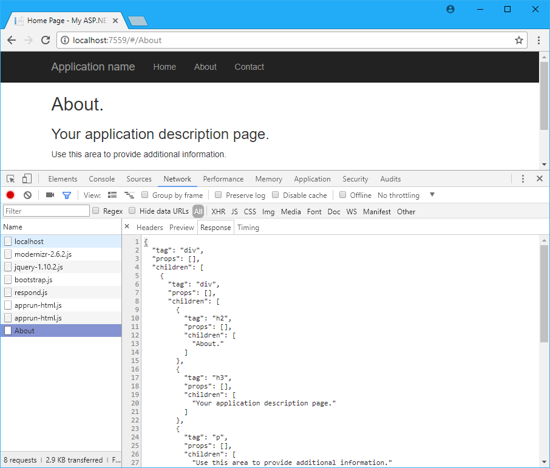

# AppRun - SSR

This project demonstrates generating virtual DOM on server side using ASP.NET MVC filter.

```
[VirtualDom]
public ActionResult About()
{
    ViewBag.Message = "Your application description page.";
    return View();
}
```



The virtual DOM can be used by [AppRun](https://github.com/yysun/apprun) to render the web page.


Have fun and send pull requests.

## License

MIT

Copyright (c) 2017 Yiyi Sun