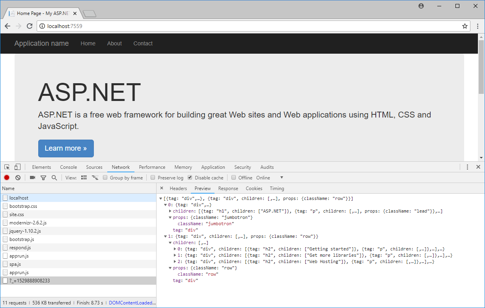

# AppRun - SSR for ASP.NET MVC

This project demonstrates the [AppRun](https://github.com/yysun/apprun) virtual DOM filter for ASP.NET MVC applications.

The virtual DOM filter does the content negotiation to output HTML or the Virtual DOM. The client-side AppRun application alters the menu links and switches the application into the SPA mode.

```C#
[VirtualDom]
public ActionResult About()
{
    ViewBag.Message = "Your application description page.";
    return View();
}
```
Initial request returns full HTML page.


AJAX request returns the Virtual DOM as JSON.



Have fun and send pull requests.

## License

MIT

Copyright (c) 2017 Yiyi Sun